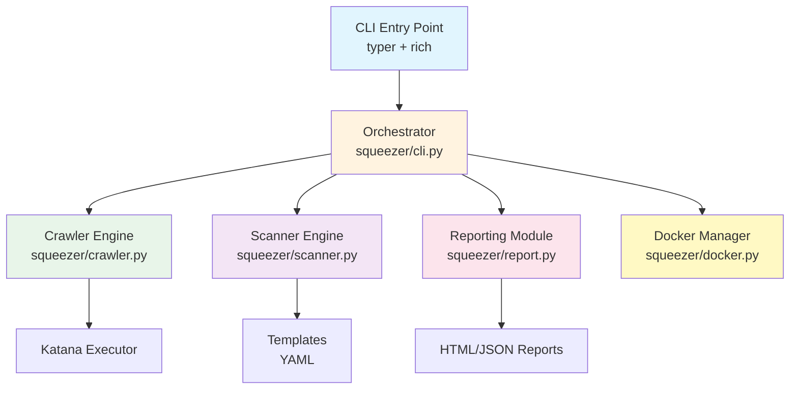
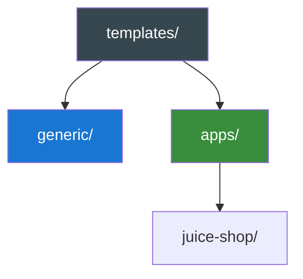

# Architecture - Squeezer DAST Framework

## 1. Introduction

This document describes the **system architecture** of **Squeezer**, a minimal template-based Dynamic Application Security Testing (DAST) framework.

---

## 2. System Architecture Overview



---

## 3. Components

### 3.1 CLI Entry Point

| Aspect | Description |
|--------|-------------|
| **Technology** | `typer` + `rich` |
| **Location** | `squeezer/cli.py` |
| **Commands** | `init`, `scan`, `apps` |

**Responsibilities:**
- Command parsing and validation
- Progress bars and tables
- Configuration loading
- User feedback and error handling

### 3.2 Crawler Engine

| Aspect | Description |
|--------|-------------|
| **Technology** | ProjectDiscovery `katana` |
| **Location** | `squeezer/crawler.py` |
| **Class** | `KatanaCrawler` |

**Responsibilities:**
- Endpoint discovery through web crawling
- JavaScript parsing and XHR extraction
- Form field identification
- Asset discovery (JS, CSS, images)

### 3.3 Scanner Engine

| Aspect | Description |
|--------|-------------|
| **Location** | `squeezer/scanner.py` |
| **Input** | Discovered endpoints + YAML templates |
| **Output** | Vulnerability findings |

**Responsibilities:**
- Template loading from `templates/`
- HTTP request execution
- Response matching (status, regex, DSL)
- Vulnerability classification by severity

### 3.4 Reporting Module

| Aspect | Description |
|--------|-------------|
| **Technology** | `jinja2` |
| **Location** | `squeezer/report.py` |

**Responsibilities:**
- HTML report generation
- JSON export for CI/CD
- Severity aggregation
- OWASP categorization

### 3.5 Docker Manager

| Aspect | Description |
|--------|-------------|
| **Technology** | Docker SDK |
| **Location** | `squeezer/docker.py` |

**Responsibilities:**
- Container lifecycle (start, stop, rm)
- Vulnerable lab deployment (Juice Shop)
- Health checks and port management

---

## 4. Data Flow


### Flow Description

| Phase | Description |
|-------|-------------|
| **1. Input** | User executes `squeezer scan` with target URL |
| **2. Config** | CLI loads `app.yaml` configuration |
| **3. Crawl** | Katana discovers endpoints and assets |
| **4. Scan** | Each endpoint is tested against all templates |
| **5. Report** | Findings are displayed and saved |

---

## 5. Template Structure



### Directory Layout

```
templates/
├── generic/                    # Universal vulnerability checks (flat YAML files)
│   ├── cors-misconfig.yaml
│   ├── idor.yaml
│   ├── input-validation.yaml
│   ├── jwt-none-algorithm.yaml
│   ├── mass-assignment.yaml
│   ├── path-traversal.yaml
│   └── sensitive-data-exposure.yaml
└── apps/                      # Application-specific checks
    └── juice-shop/            # OWASP Juice Shop tests
        ├── app-auth.yaml
        ├── app-noauth.yaml
        ├── b2b-rce.yaml
        ├── file-upload-bypass.yaml
        ├── jwt-none-algorithm.yaml
        ├── lab.yaml
        ├── lfi-null-byte.yaml
        ├── negative-quantity.yaml
        ├── price-manipulation.yaml
        ├── report.html
        └── sensitive-data-exposure.yaml
```

### Template Schema

```yaml
id: unique-identifier
info:
  name: Vulnerability Name
  description: Brief description
  owasp_category: OWASP category
  severity: critical|high|medium|low|info
  tags: [tag1, tag2]
requests:
  - name: Request description
    method: GET|POST|PUT|DELETE|PATCH
    path: /api/target
    headers: {...}
    body: {...}
    matchers:
      - type: word|regex|status
        part: header|body
        words: [...]
        condition: and|or
    matchers_condition: and|or
```

---

## 6. Deployment Architecture


### Deployment Modes

| Mode | Description | Use Case |
|------|-------------|----------|
| **Remote Scan** | Scan external URL | Production testing, CI/CD |
| **Local Lab** | Docker + vulnerable app | Learning, testing, demo |

---

## 7. File Structure

```
dast-mvp/
├── squeezer/
│   ├── __init__.py
│   ├── cli.py              # Main CLI entry point
│   ├── crawler.py          # KatanaCrawler implementation
│   ├── scanner.py          # Template-based scanner
│   ├── report.py           # HTML/JSON report generation
│   ├── docker.py           # Docker/lifecycle management
│   └── scaffolder.py       # Config generation
├── templates/
│   ├── generic/            # Universal vulnerability templates
│   └── apps/               # Application-specific templates
├── docs/                   # Documentation
└── pyproject.toml          # Project metadata
```

---

## 8. Related Documentation

- [design-decisions.md](./design-decisions.md) - Design decisions and rationale
- [README.md](../README.md) - Quick start guide
- [prompts.md](./prompts.md) - Development prompts and queries
